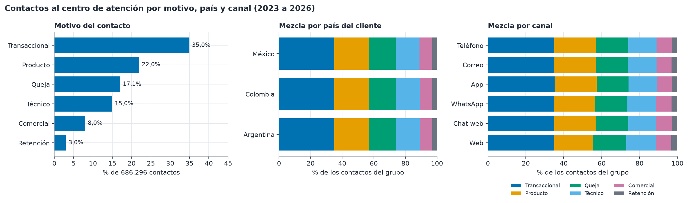
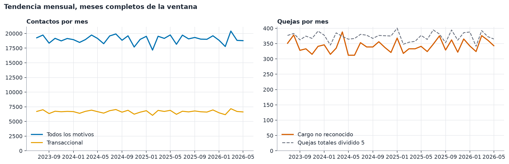
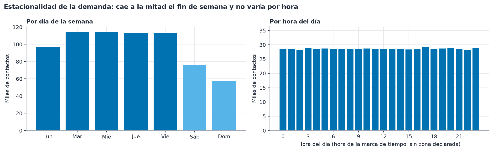
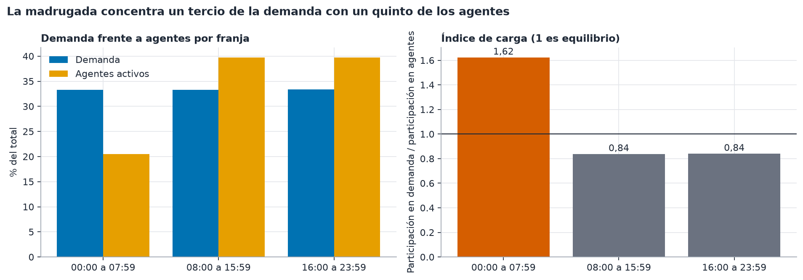
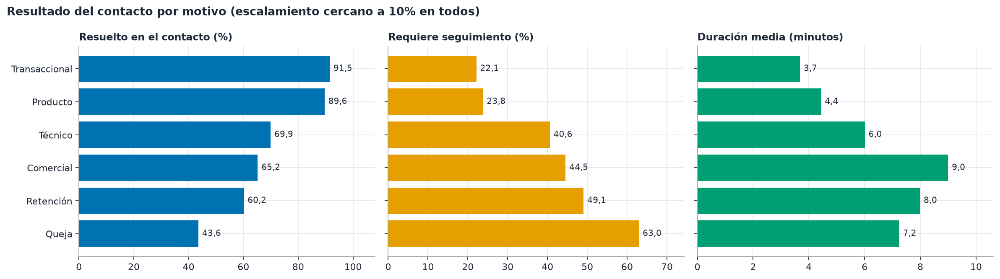
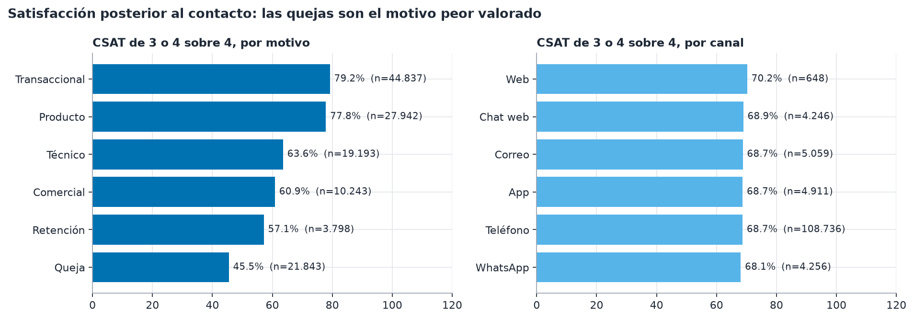
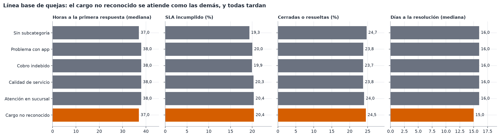
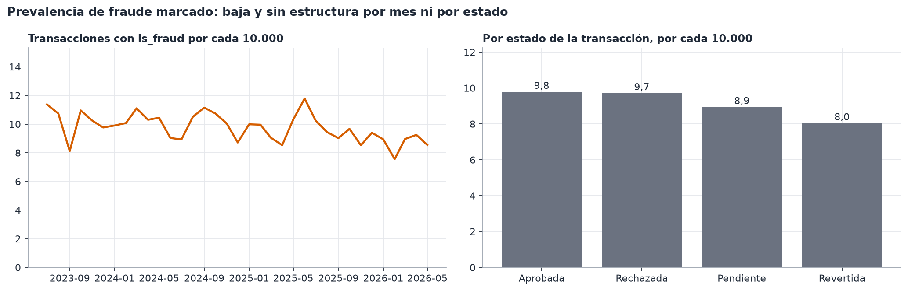
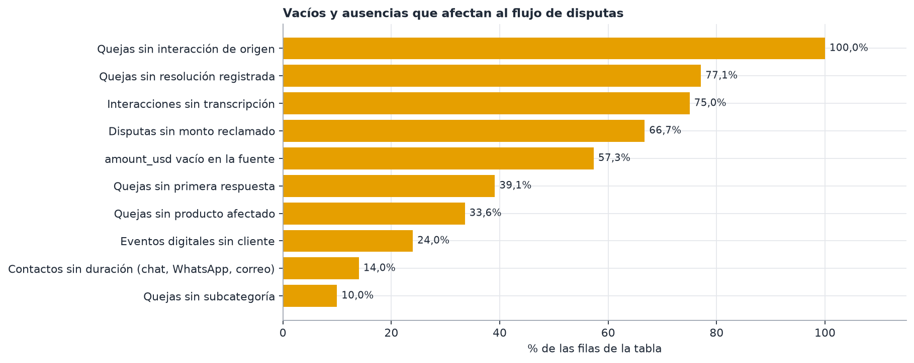
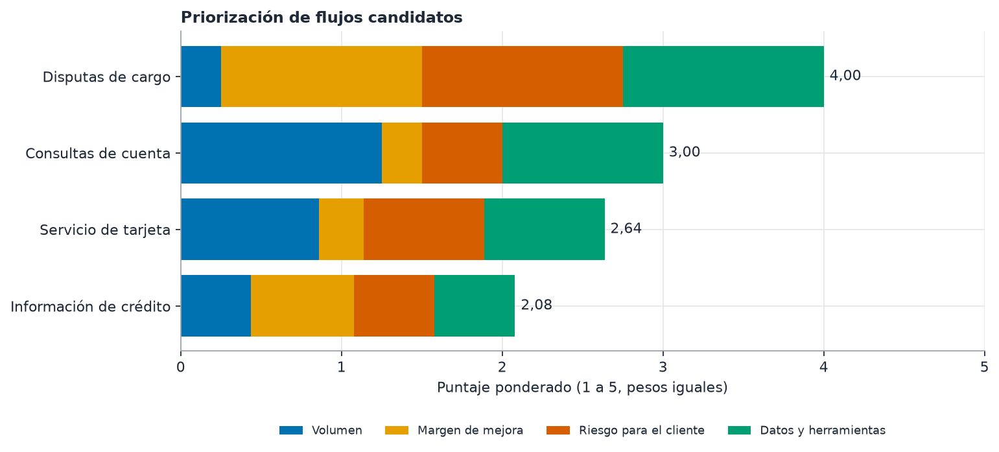

# Criterio 1: un problema respaldado por datos

Este documento lo genera `uv run python -m latam_datos.analisis` (consultas en `datos/analisis/consultas.sql`, cifras en `figuras/cifras.json`). Todas las cifras salen de BigQuery, dataset `latam_bank`, capa plata (sin duplicados y con tipos canónicos). Los datos son sintéticos, cubren del 2023-06-17 al 2026-06-18 y llegan hasta tres países: México, Colombia y Argentina. Lo que no sale de una consulta se marca como supuesto.

## 1. Resumen

El centro de atención recibió 686.296 contactos de 148.443 clientes, con una demanda estable (variación de 0,3% entre los primeros y los últimos doce meses completos). El motivo más frecuente es transaccional (35,0%), pero en las interacciones el motivo no pasa de la categoría gruesa: no existe un motivo fino que aísle los cargos no reconocidos. Esa señal solo aparece en las quejas, donde "Cargo no reconocido" es la subcategoría más grande (12.297 de 67.095, 18,3%) y se atiende con una primera respuesta mediana de 37 horas, 20,4% de SLA incumplido y solo 24,5% de casos cerrados. La contención de un fraude se mide en minutos, no en días. La madrugada (00:00 a 07:59) concentra 33,3% de la demanda con 20,5% de los agentes activos (rotativos repartidos en tres, supuesto). Por eso el flujo propuesto es la recepción de disputas de transacciones, con atención a cualquier hora.

## 2. Motivos de contacto

Fuente: `plata_call_center_interactions` (sin filtro) unida a `plata_customers` para el país; consultas `motivo_canal`, `motivo_pais`, `motivo_mes`.

| Motivo | Contactos | Participación | Resuelto en el contacto | Seguimiento | Escalado | Duración media (min) | Espera media, llamada entrante (min) |
|---|---|---|---|---|---|---|---|
| Transaccional | 240.056 | 35,0% | 91,5% | 22,1% | 9,9% | 3,7 | 2,0 |
| Producto | 150.863 | 22,0% | 89,6% | 23,8% | 10,0% | 4,4 | 2,0 |
| Queja | 117.021 | 17,1% | 43,6% | 63,0% | 10,0% | 7,2 | 2,0 |
| Técnico | 102.899 | 15,0% | 69,9% | 40,6% | 10,1% | 6,0 | 2,0 |
| Comercial | 54.879 | 8,0% | 65,2% | 44,5% | 9,8% | 9,0 | 2,0 |
| Retención | 20.578 | 3,0% | 60,2% | 49,1% | 9,8% | 8,0 | 2,0 |

La mezcla de motivos es prácticamente idéntica en los tres países y en los seis canales (figura anterior): no hay un canal ni un país con un problema propio. El canal es el teléfono en 85,0% de los contactos; correo 4,0%, app 3,8%, WhatsApp 3,3%, chat web 3,3% y web 0,5%. Por país del cliente: México 50,0%, Colombia 30,1% y Argentina 19,9%.

**Contactos por cargos no reconocidos.** En las interacciones no se pueden contar: `contact_reason` es igual a `reason_category` en 100% de las filas y las transcripciones solo traen la intención `consulta_general` (95,1% de 171.321). Lo observable es la queja formal: 12.297 quejas "Cargo no reconocido", 18,3% del total de quejas y 20,4% de las que traen subcategoría (consulta `quejas_linea_base`, `plata_complaints`). Por país del cliente representan 18,4% en México, 18,3% en Colombia, 18,2% en Argentina; por canal de recepción, 18,3% en centro de llamadas, 17,9% en correo, 18,3% en web, 19,3% en app, 17,6% en sucursal, 19,2% en regulador. Cada queja es un contacto que no se resolvió a la primera, de modo que 12.297 es una cota inferior del tráfico de disputas. La cota superior razonable es el motivo Transaccional (240.056).

**Tendencia.** El promedio mensual pasó de 18.991 a 19.043 contactos (0,3%); las quejas por cargo no reconocido, de 338 a 348 al mes (2,9%). Se comparan los primeros y los últimos doce meses completos; el primer y el último mes de la ventana son parciales y se excluyen. No hay crecimiento que justifique urgencia por volumen; la urgencia viene de la calidad de la atención.

**Estacionalidad.** El día con más contactos es el martes; los días hábiles promedian 110.490 y el fin de semana 66.924 (61% de un día hábil). Por hora no hay patrón: el máximo (29.081) es solo 2,9% mayor que el mínimo (28.270). Esa planicie es un artefacto de los datos sintéticos y no debe leerse como comportamiento real; se declara así en los supuestos. La hora usada es la de `interaction_date`, sin zona horaria declarada.

**Contactos repetidos.** Un cliente vuelve a contactar en menos de 7 días en 2,7% de los contactos, y por el mismo motivo en 0,6% (consulta `recurrencia`, ventana por cliente). Por el mismo motivo en 30 días: 2,8%. El motivo Transaccional es el que más se repite: 0,9% a 7 días, contra 0,5% en Queja. La repetición es baja, por lo que la reincidencia por contacto no es el problema a resolver. En quejas, 14,7% de las de cargo no reconocido son de clientes reincidentes.

## 3. Demanda frente a capacidad

Fuente: `plata_service_agents` (1.200 agentes, 1.090 activos) y `plata_call_center_interactions`; consultas `agentes`, `hora_dia`, `carga_turno`.

| Franja | Demanda | Agentes activos (rotativos repartidos en tres) | Índice de carga |
|---|---|---|---|
| 00:00 a 07:59 | 228.311 (33,3%) | 223 (20,5%) | 1,62 |
| 08:00 a 15:59 | 228.685 (33,3%) | 433 (39,8%) | 0,84 |
| 16:00 a 23:59 | 229.300 (33,4%) | 433 (39,8%) | 0,84 |

El índice divide la participación en la demanda entre la participación en la capacidad. El reparto de los agentes rotativos en tres partes iguales es un supuesto. Hay 163 agentes activos de turno nocturno y 181 rotativos. Los agentes de fraude suman 105 (7 con portugués) y los de quejas y reclamos, 78; los de fraude activos de turno nocturno son 24.

Dos cautelas. Primero, el turno del agente no restringe cuándo atiende: de los 228.311 contactos de madrugada, solo 14,9% los atendió un agente de turno nocturno; el resto lo atendieron agentes de otros turnos. El dato no permite medir cobertura real, solo capacidad declarada. Segundo, los tres países de clientes son hispanohablantes: no hay clientes de Brasil, de modo que los 129 agentes con portugués no son una restricción para este flujo, y todas las transcripciones están en español (100% de 171.321).

**Espera, duración y abandono.** La espera media de una llamada entrante es 2,0 minutos y la duración media de un contacto, 5,4 (consultas `tiempos_resultados`). La duración solo existe para teléfono y web, y para una fracción de la app: chat web, WhatsApp y correo la traen vacía. La espera solo existe para llamadas entrantes. No hay campo de abandono, por lo que la tasa de abandono no se puede medir y no se inventa. Por motivo, la duración va de 3,7 a 9,0 minutos; los motivos de queja, comerciales y de retención son los más largos.

**Dónde ayuda la IA al frente.** Con una demanda sin picos horarios, el valor no está en recortar picos, sino en atender a cualquier hora y en fin de semana sin ampliar turnos nocturnos, y en liberar a los agentes humanos para los casos que requieren juicio. Los eventos digitales apuntan en la misma dirección: hay 901.824 inicios de transferencia, 902.225 de pago, 901.039 consultas de movimientos y 890.625 vistas de ayuda (`plata_digital_events`), de modo que el cliente ya consulta sus movimientos en la app antes de llamar.

## 4. Resultados de la atención

76,6% de los contactos terminan resueltos en el mismo contacto y 10,0% se escalan, con diferencias grandes por motivo en resolución y ninguna en escalamiento (cercano a 10% en todos). Las quejas se resuelven en 43,6% de los casos y requieren seguimiento en 63,0%.

**Satisfacción.** Fuente: `plata_satisfaction_surveys` unida a las interacciones por `interaction_id`. El CSAT usa una escala de 1 a 4 y se reporta como la proporción de respuestas de 3 o 4.

| Motivo | Encuestas CSAT | Media (1 a 4) | Respuestas 3 o 4 |
|---|---|---|---|
| Transaccional | 44.837 | 2,91 | 79,2% |
| Producto | 27.942 | 2,90 | 77,8% |
| Técnico | 19.193 | 2,70 | 63,6% |
| Comercial | 10.243 | 2,66 | 60,9% |
| Retención | 3.798 | 2,61 | 57,1% |
| Queja | 21.843 | 2,43 | 45,5% |

Los canales no cambian el cuadro: la proporción de respuestas altas va de 68,1% a 70,2%. En NPS (63.668 encuestas, escala observada de 2 a 7) la fuente solo trae las categorías Detractor y Pasivo, sin promotores, y 70,7% de las respuestas son de detractores; por eso el NPS clásico no se puede calcular y la línea base usa CSAT. El CES medio es 2,77 sobre 4 (21.235 encuestas).

**Quejas y SLA.** Fuente: `plata_complaints`, línea base por subcategoría.

| Subcategoría | Quejas | Horas a la asignación (mediana) | Horas a la primera respuesta (mediana, p90) | Días a la resolución (mediana) | SLA incumplido | Cerradas o resueltas | Reincidentes |
|---|---|---|---|---|---|---|---|
| Cargo no reconocido | 12.297 | 12 | 37, 58 | 15 | 20,4% | 24,5% | 14,7% |
| Atención en sucursal | 11.892 | 12 | 38, 58 | 16 | 20,4% | 24,0% | 15,2% |
| Calidad de servicio | 11.886 | 13 | 38, 58 | 16 | 20,3% | 23,8% | 15,0% |
| Cobro indebido | 12.194 | 12 | 38, 58 | 16 | 19,9% | 23,7% | 15,3% |
| Problema con app | 12.128 | 13 | 38, 58 | 16 | 20,0% | 23,8% | 15,4% |
| Sin subcategoría | 6.698 | 12 | 37, 57 | 16 | 19,3% | 24,7% | 14,3% |

Las cinco subcategorías con nombre se comportan casi igual: la primera respuesta mediana va de 37 a 38 horas, el SLA incumplido de 19,3% a 20,4% y los casos cerrados de 23,7% a 24,7%. El cargo no reconocido no se atiende peor que las demás y tampoco mejor: el argumento no es una diferencia entre subcategorías, sino el nivel absoluto. Para un cargo no reconocido el cliente espera 37 horas (p90 58) una primera respuesta, el SLA se incumple en 20,4% (intervalo de Wilson al 95%: 19,7% a 21,1%) y 75,5% de los casos siguen abiertos, en proceso o escalados. Esto es una línea base, no una prueba de que este motivo sea el peor. Además, el campo `sla_breached` no se relaciona con `resolution_days` en la muestra, así que se reporta tal como viene.

**Fraude y montos.** Fuente: `plata_transactions` (`is_fraud`, `amount_usd` con la regla de plata). 4.316 de 4.425.008 transacciones están marcadas como fraude (0,10%), por un total de USD 6.818.342; 92,4% de ellas están aprobadas, es decir, el dinero salió. La prevalencia es plana por mes y por estado. Entre las disputas con monto declarado (4.090 de 12.297), la mediana reclamada es de 2.553 USD, 2.502 ARS, 2.398 COP, 2.679 MXN (p90 cercano a 4.533), en moneda local sin convertir; 909 tuvieron compensación. Estos montos no tienen respaldo transaccional (la queja no enlaza con la transacción), así que sirven para dimensionar, no para conciliar.

## 5. Calidad de datos y restricciones del flujo

Fuentes: `datos/LIMITACIONES.md` (bronce) y la consulta `calidad` (plata). Los vacíos están ordenados en la figura; los que afectan al diseño son:

- **Monto en dólares.** `amount_usd` viene vacío en 57,3% de las filas de origen (2.537.456 de 4.425.008): todas las transacciones en USD (el monto ya está en dólares) y 99.477 en moneda local, que plata recalcula con la tasa del día. El flujo debe usar `amount_usd` de plata y la bandera `amount_usd_origen`, no el campo crudo.
- **Sin enlace entre queja y transacción.** `origin_interaction_id` está vacío en 100% de las quejas y `affected_product_id` en 33,6%. El cargo disputado lo tiene que identificar el cliente en la conversación, con la transacción como evidencia; no se puede precargar desde la queja.
- **Disputas sin monto.** 66,7% de las quejas por cargo no reconocido no traen monto reclamado.
- **Eventos digitales sin cliente.** 24,0% de 15.620.994 eventos no traen `customer_id` (todos traen sesión), de modo que el recorrido digital previo a un contacto solo se reconstruye para tres cuartas partes del tráfico.
- **Sin motivo fino ni transcripciones útiles.** Las interacciones traen solo la categoría gruesa y 75,0% no tiene transcripción; las existentes son plantillas con una intención casi única.
- **Resolución de quejas incompleta.** 77,1% de las quejas no tienen fecha de resolución y 39,1% no tienen primera respuesta; los tiempos de la línea base se calculan sobre las que sí la tienen, con n declarado, y pueden ser optimistas.
- **Escalas.** CSAT y CES de 1 a 4; NPS de 2 a 7 sin promotores.
- **Idioma.** Todo en español; el flujo no necesita portugués para estos clientes.
- **Datos sintéticos.** Planicie por hora, indicadores casi idénticos entre subcategorías y etiquetas de fraude sin estructura. Los resultados describen este conjunto, no al banco real. La ventana es 2023-06-17 a 2026-06-17 y `campaign_sends` empieza el 2023-07-01.

## 6. Priorización del flujo

Se puntúan cuatro flujos candidatos de 1 a 5 en cuatro criterios con pesos iguales (volumen 25%, margen 25%, riesgo 25%, datos 25%). Volumen y margen son medidos y se reescalan entre los candidatos; riesgo y datos son juicios declarados. El margen es la fracción de casos sin cierre en el contacto (para disputas, la fracción de quejas que no están cerradas ni resueltas). Riesgo: gravedad del error para el cliente (una disputa mal recibida deja un fraude sin contener). Datos: respaldo en las tablas de oro operacional (`ficha_transaccion`, `riesgo_transaccion`, `reclamos_cliente`).

| Flujo candidato | Proxy de volumen (tabla y filtro) | Volumen | Sin cierre | Margen | Riesgo | Datos | Puntaje |
|---|---|---|---|---|---|---|---|
| Disputas de cargo | 12.297 (quejas con subcategoría Cargo no reconocido) | 1,0 | 75,5% | 5,0 | 5 | 5 | 4,00 |
| Consultas de cuenta | 240.056 (interacciones con motivo Transaccional) | 5,0 | 8,5% | 1,0 | 2 | 4 | 3,00 |
| Servicio de tarjeta | 150.863 (interacciones con motivo Producto) | 3,4 | 10,4% | 1,1 | 3 | 3 | 2,64 |
| Información de crédito | 54.879 (interacciones con motivo Comercial) | 1,7 | 34,8% | 2,6 | 2 | 2 | 2,08 |

El volumen de las disputas está medido solo con quejas formales y no con contactos, así que subestima su tamaño y juega en contra de la disputa en este puntaje. Aun así el flujo líder es **disputas de cargo**, con 4,00 puntos. Sensibilidad al peso del volumen (el resto se reparte en proporción): 10%: disputas de cargo, 25%: disputas de cargo, 40%: consultas de cuenta, 50%: consultas de cuenta, 60%: consultas de cuenta, 70%: consultas de cuenta, 80%: consultas de cuenta. El liderazgo cambia cuando el volumen pesa 40% o más, hacia las consultas de cuenta, que ya se resuelven en 91,5% y dejan poco margen para mejorar.

Por qué disputas de transacciones y no un flujo de más volumen: es el único candidato donde el problema medido es grave y el error es costoso (los cargos no reconocidos tardan 37 horas en recibir primera respuesta y 75,5% no está cerrado), donde hay una fricción que el cliente siente de inmediato y donde el banco ya tiene las herramientas de datos para actuar con evidencia (ficha de la transacción, banda de riesgo y estado de reclamos). Las consultas de cuenta y el servicio de tarjeta ya se resuelven en cerca de nueve de cada diez contactos. El flujo de crédito no tiene respaldo de datos suficiente ni un problema medible.

## 7. Resultados buscados y línea base

**Resultado para el cliente.** Que quien desconoce un cargo reciba una primera respuesta en minutos y no en horas, con el cargo identificado y el caso correctamente clasificado y entregado a una persona con contexto cuando corresponda. **Resultado para el banco.** Menos horas de atención humana por recepción de disputas, menor incumplimiento de SLA y más casos cerrados, sin sacrificar la protección contra el fraude. La dirección es la que se indica; las metas numéricas las fija Gobierno con esta línea base.

| Indicador de base | Valor | n | Fuente y filtro |
|---|---|---|---|
| Duración media del contacto transaccional | 3,7 min | 206.465 | interacciones, motivo Transaccional, duration_seconds no vacío |
| Duración mediana y p90, llamada entrante transaccional | 3,4 y 5,5 min | 168.074 | interacciones, motivo Transaccional, canal Phone, tipo Inbound Call |
| Espera media, llamada entrante | 2,0 min | 480.678 | interacciones, tipo Inbound Call, wait_time_seconds no vacío |
| Resuelto en el contacto, motivo Transaccional | 91,5% | 240.056 | interacciones, was_resolved |
| Resuelto en el contacto, todos los motivos | 76,6% | 686.296 | interacciones, was_resolved |
| Escalado, todos los motivos | 10,0% | 686.296 | interacciones, was_escalated |
| Requiere seguimiento, todos los motivos | 34,8% | 686.296 | interacciones, requires_followup |
| CSAT de 3 o 4 sobre 4, todos los motivos | 68,7% | 127.856 | satisfaction_surveys, survey_type CSAT, unidas por interaction_id |
| CSAT de 3 o 4 sobre 4, motivo Transaccional | 79,2% | 44.837 | idem, motivo Transaccional |
| Disputa: horas a la primera respuesta (mediana, p90) | 37 y 58 h | 7.567 | complaints, subcategory Cargo no reconocido, first_response_date no vacía |
| Disputa: días a la resolución (mediana, p90) | 15 y 27 | 2.862 | complaints, Cargo no reconocido, resolution_days no vacío |
| Disputa: SLA incumplido | 20,4% | 12.297 | complaints, Cargo no reconocido, sla_breached |
| Disputa: cerrada o resuelta | 24,5% | 12.297 | complaints, Cargo no reconocido, status Resolved o Closed |
| Disputa: reincidente | 14,7% | 12.297 | complaints, Cargo no reconocido, is_repeat_complainer |
| Disputa: satisfacción con la resolución (media, 1 a 4) | 3,07 | 471 | complaints, Cargo no reconocido, resolution_satisfaction no vacía |
| Prevalencia de fraude marcado | 9,8 por 10.000 | 4.425.008 | transactions, is_fraud |

**Costo por contacto (supuesto, no sale de los datos).** Los datos no traen costos. Se usan los rangos de la investigación 11 de `datos/definicion.md`: USD 7 a 14 por contacto de voz y USD 3 a 7 por chat. Con 12.297 quejas de cargo no reconocido en 36 meses (alrededor de 342 al mes, cota inferior), la recepción por voz costaría entre USD 2.391 y 4.782 al mes y por chat entre USD 1.025 y 2.391. Es un orden de magnitud para comparar escenarios, no un ahorro comprometido.

**Cómo se usará la línea base.** La evaluación del sistema compara contra estas cifras sobre casos del mismo alcance: tiempo hasta la primera respuesta, proporción cerrada con evidencia, SLA, CSAT posterior y duración humana por caso. Dos limitaciones: las quejas tienen n grande pero sin enlace a transacciones, y el CSAT de resolución de quejas tiene solo 471 respuestas para disputas, así que su intervalo es amplio.

## 8. Cómo reproducir

`uv run python -m latam_datos.analisis` (requiere ADC de Google Cloud y `LATAM_GCP_PROJECT`, `LATAM_BQ_DATASET`, opcional `LATAM_GCP_LOCATION`). `--desde-cache` regenera figuras e informe desde `figuras/cifras.json` sin consultar BigQuery. Ninguna cifra ni figura se edita a mano.
