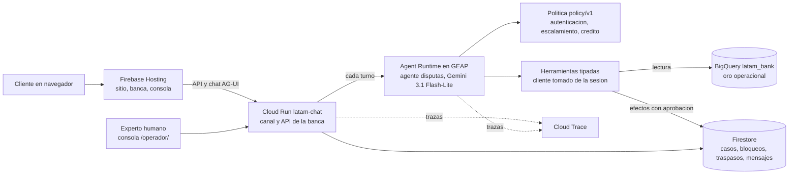

# Criterios 2 y 3: la solución

**Cara:** Presidencia con Tecnología, IA y Gobierno. **Fecha:** 4 de octubre de 2026. Cifras de evaluación: [04_evaluacion](04_evaluacion.md). Volver al [reporte final](00_reporte_final.md).

## 1. Qué hace el sistema

LATAM Bank atiende la **recepción de disputas por cargos no reconocidos**: el cliente entra a una banca en línea de demostración, abre un movimiento y elige "No reconozco este cargo"; el asistente recibe esa transacción ya identificada por el servidor, confirma, abre el reclamo con aprobación en pantalla o, cuando corresponde, pasa a una persona con el contexto completo. El flujo se eligió con datos ([01_problema](01_problema.md) sección 6) y se acotó a un solo flujo coherente (D-02, [decisiones](../decisiones.md)).

## 2. Arquitectura

| Pieza | Qué es | Fuente |
|---|---|---|
| Canal | Cloud Run `latam-chat` (1 vCPU, 1 GiB, 0 a 1 instancia, concurrencia 40) con la cuenta `latam-chat@` de mínimo privilegio; reenvía cada turno al agente, resuelve las aprobaciones y sirve la API de la banca y de la consola | [ARRANQUE](../../tecnologia/infra/ARRANQUE.md); [tecnologia/README](../../tecnologia/README.md) |
| Agente | Agent Runtime de GEAP, agente propio (PydanticAI envuelto); modelo `gemini-3.1-flash-lite` (región `global`, temperatura 0,0 en la evaluación), en producción prompt `disputas/agente@1.5.0` y trabajador `disputas` 0.6.0; la evaluación congelada de [04](04_evaluacion.md) se hizo con 1.3.0 y 0.4.0; Sessions de 24 h | [ESTADO](../ESTADO.md) sección GEAP; [04_evaluacion](04_evaluacion.md) sección 2 |
| Política como código | `gobierno/politica/v1/` (escalamiento, crédito provisional, riesgo, autonomía por acción, traspaso) con huella en `manifest.yaml`; el motor y las herramientas la leen | [autonomia.yaml](../../gobierno/politica/v1/autonomia.yaml), [escalamiento.yaml](../../gobierno/politica/v1/escalamiento.yaml) |
| Herramientas | siete: `transacciones_recientes`, `transaccion`, `estado_productos`, `ficha_transaccion`, `casos_abiertos` (lectura, `acr1`), `bloquear_tarjeta` (`acr1` más tarjeta confirmada), `abrir_disputa` (`acr2`), `escalar` (`acr1`) | [catalogo.py](../../tecnologia/src/latam_tecnologia/herramientas/catalogo.py) |
| Casos | Firestore nativo (`nam5`): `casos`, `bloqueos`, `traspasos`, `conversaciones/{id}/mensajes`, compartido por Cloud Run, Agent Runtime y la consola | [API_BANCA](../../tecnologia/web/API_BANCA.md) |
| Datos | BigQuery `latam_bank` con capas como prefijo; el agente solo lee oro operacional, sin PII, sin `is_fraud` ni `fraud_score` en las vistas de transacciones | [datos/README](../../datos/README.md) |
| Sitio | Firebase Hosting: sitio público por país, banca, consola, transparencia y privacidad; CSP estricta | [firebase.json](../../firebase.json) |
| Trazas | OpenTelemetry a Cloud Trace: un span por turno, por llamada al modelo y por herramienta, con id y versión del trabajador, sin contenido | [observabilidad.py](../../tecnologia/src/latam_tecnologia/observabilidad.py) |

Decisiones que sostienen la forma: motor y herramientas propios en lugar de un marco de agentes (ADR [0001](../../tecnologia/adr/0001-motor-de-flujo-propio.md)), sin MCP en el camino crítico (ADR [0002](../../tecnologia/adr/0002-sin-mcp-en-el-camino-critico.md)), chat con AG-UI (ADR [0005](../../tecnologia/adr/0005-chat-con-ag-ui.md)), agente en GEAP (D-32), banco de punta a punta (D-33).

## 3. Control de la automatización (criterio 3)

| Qué | Cómo se hace cumplir | Fuera de la prosa del modelo |
|---|---|---|
| El cliente de cada consulta | sale de `SesionAutenticada`; ninguna herramienta acepta un identificador de cliente; la conversación debe ser del cliente de la sesión | sí (`_exigir`, `_exigir_conversacion` en `catalogo.py`) |
| Nivel mínimo por acción | `autonomia.yaml` (A-02 a A-13); sesión vencida o de nivel insuficiente lanza `AccesoDenegado` | sí |
| Aprobación | las herramientas con efecto devuelven una aprobación diferida; el canal la resuelve con un evento de un solo uso con vigencia de 5 minutos; un texto escrito no la resuelve | sí ([chat_web.py](../../tecnologia/src/latam_tecnologia/canales/chat_web.py), `VIGENCIA_CONFIRMACION`) |
| Idempotencia | llave por acción y transición; reintentar no duplica efectos | sí ([retoma.py](../../tecnologia/src/latam_tecnologia/motor/retoma.py)) |
| Qué se informa | solo `AccionVerificada` con resultado releído; el verificador del arnés marca acciones afirmadas sin efecto | parcial: el texto lo redacta el modelo y el verificador cubre frases conocidas ([04](04_evaluacion.md) sección 8, hallazgo 7) |
| Cuándo escalar | ESC-01 (urgente), ESC-02 (rechazado, fallido o revertido), ESC-03 (producto desconocido), ESC-04 (monto sobre umbral, provisional en USD 1.000) | **parcial**: el motor lo aplica; la herramienta `abrir_disputa` no consulta ESC-03 (hallazgo 1 de 04) |
| Crédito | solo un tope provisional (USD 200, supuesto sintético) como bandera del caso; el dinero lo mueve el back office; el agente no calcula elegibilidad | sí ([credito_provisional.yaml](../../gobierno/politica/v1/credito_provisional.yaml)) |

## 4. Flujos de disputa

### 4.1 Normal

1. La banca fija en el servidor la transacción elegida y abre la conversación (`POST /api/banca/movimientos/{tx_ref}/reclamar`).
2. El agente lee la ficha (directorio de comercios, compras previas de 12 meses, posibles duplicados de 48 h, estado explicado) y, si coincide con el relato, llama a `abrir_disputa`.
3. La pantalla muestra monto y tarjeta enmascarada leídos de la base. El cliente aprueba (o rechaza).
4. Se radica el caso en Firestore, con crédito provisional si el tope lo permite, y el agente informa: hecho, no hecho, qué sigue y el plazo de la norma del país de la cuenta.

### 4.2 Ambiguo o no soportado

- **Ambiguo** (dos cargos candidatos, monto inexistente, relato sin datos, mensaje en inglés): el agente pregunta lo mínimo, no radica sin transacción identificada y se abstiene o pasa a una persona si no se resuelve (TRA-06, dos aclaraciones fallidas, está en `policy/v1` pero con `en_motor: false`: no lo ejecuta el motor). Casos A del retenido: 15 corridas, 11 pasan ([04](04_evaluacion.md) 5.3).
- **No soportado** (aumento de cupo, consulta no bancaria, crédito): el agente se abstiene sin elegibilidad ni promesa y ofrece el canal. Casos F: 6 de 6 pasan (misma tabla).

### 4.3 Traspaso a una persona

Disparadores de `traspaso.yaml` y de `escalamiento.yaml`: urgencia o engaño telefónico (P1), cargo no disputable, producto no encontrado, el cliente pide una persona, monto sobre umbral (la disputa se radica y además se escala). El paquete de traspaso (`PaqueteTraspaso`, [clientes/definicion.md](../../clientes/definicion.md) sección 2.5.2) tiene 19 campos:

| Grupo | Campos |
|---|---|
| Identidad del traspaso | 1 identificadores, 2 prioridad P1 a P4, 3 motivo con regla y versión, 4 cola destino |
| Cliente y canal | 5 idioma, registro y país, 6 canales, 7 identidad (`acr`, método, hora) |
| Lo que dijo y cómo se interpretó | 8 solicitud (cita enmascarada), 9 interpretación marcada como de la IA |
| Hechos y acciones | 10 hechos verificados con fuente y hora, 11 acciones realizadas, 12 no realizadas, 13 conflictos (declarado frente a registro) |
| Lo pendiente | 14 preguntas abiertas, 15 plazos en curso, 16 compromisos comunicados |
| Evidencia | 17 preferencias, 18 evidencia (traza, reglas, plantillas), 19 transcripción enmascarada |

No lleva nombre, documento, número completo de tarjeta, atributos protegidos, segmento ni `fraud_score`. La consola `/operador/` ordena la cola por prioridad y antigüedad, el experto toma el caso, escribe en el mismo hilo (el cliente ve el mensaje) y resuelve con una etiqueta de corrección que nunca entra al retenido ([API_BANCA](../../tecnologia/web/API_BANCA.md), sección Experto). El riesgo de plazo solo podría subir un nivel la prioridad (hasta P2); con el resultado negativo no cambia nada ([03_datos_y_ml](03_datos_y_ml.md) sección 4).

## 5. Autenticación

Los datos son sintéticos y no hay un proveedor de identidad: la demostración usa una **sesión de prueba de confianza**. El cliente elige una de seis personas ficticias (dos por país); el servidor emite una sesión con nivel `acr`, vencimiento (30 minutos en el canal de demostración, `VIGENCIA_SESION`) y reloj inyectable. Un número de documento o de cliente nunca autentica. La sesión queda en memoria del proceso (límite en [06_produccion](06_produccion.md)). Niveles:

| Nivel | Qué permite | Acciones |
|---|---|---|
| `acr1` | consulta de sesión de confianza del canal | leer movimientos, productos y casos; bloquear tarjeta (D-31); escalar |
| `acr2` | verificación adicional (OTP simulado) | radicar una disputa |

La consola del experto usa un código de demostración (`LATAM_OPERADOR_CODIGO`, vigencia de 8 horas, comparación en tiempo constante, 5 fallos por minuto antes de responder 429).

## 6. Idioma y registro

El selector de la banca, el asistente y el chat ofrece "Español, usted", "Español, vos" y "Português, você"; viaja como `registro` (`usted`, `vos`, `voce`) por sesión, textos, aprobaciones y paquete (`idioma = pt`). El prompt (desde 1.3.0) responde en el idioma del último mensaje, con cambio y mezcla de idioma. Hay 41 plantillas por idioma con retrotraducción y linter, y 9 escenarios en portugués en el arnés (9 de 9 pasan en su última corrida, k=1, sin hablante nativo; [geap_pt](../../ia/evaluacion/reportes/geap_pt_2026-10-03.md)). El retenido incluye 13 de 32 casos en portugués ([04](04_evaluacion.md) sección 3).

Límites: los clientes son de México, Colombia y Argentina; los montos siguen el formato del país de la cuenta; Pix, MED y Procon no se presentan como aplicables, pero ningún escenario con verificador propio lo mide; las páginas públicas de marketing siguen en español ([LIMITACIONES](../../datos/LIMITACIONES.md)).

## 7. Qué no está desplegado

WhatsApp y voz (ADR [0003](../../tecnologia/adr/0003-dos-canales-un-nucleo.md), [0004](../../tecnologia/adr/0004-voz-en-cascada-con-pipecat.md), [0008](../../tecnologia/adr/0008-transporte-de-voz-por-perfil.md)) quedaron como diseño y spike (S4: retoma idempotente de chat a voz); en producción corre el chat web. No hay integración con un proveedor de identidad ni con un banco real: el banco y la idempotencia por instancia son simulados donde se indica en [06_produccion](06_produccion.md).
